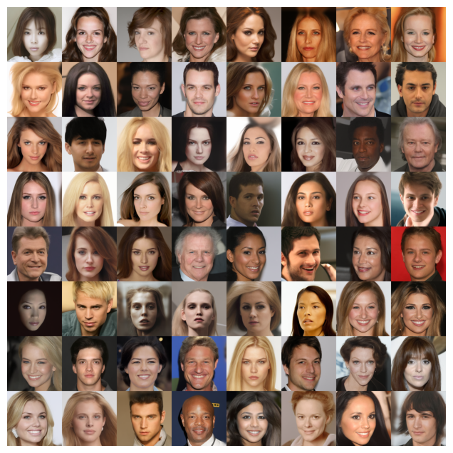
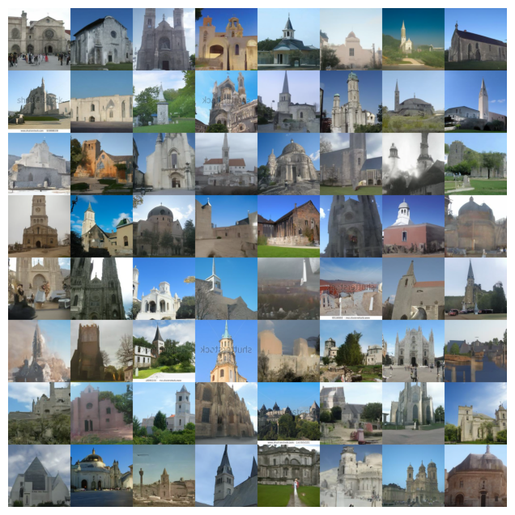

# Score-based Generative Model with Adaptive Momentum Sampling

This repo contains the official implementation for the paper [Score-based Generative Model with Adaptive Momentum Sampling](https://arxiv.org/abs/2405.13726), and is highly build upon the excellent previous work by [Yang Song](https://yang-song.github.io) in [Score-Based Generative Modeling through Stochastic Differential Equations](https://github.com/yang-song/score_sde_pytorch) and [Jaehyeong Jo](https://harryjo97.github.io/) in [Score-based Generative Modeling of Graphs via the System of Stochastic Differential Equations](https://github.com/harryjo97/GDSS). For any problems, please [contact us](zqwen@nudt.edu.cn).


## Reproducibility

For the image generation  tasks, please run the following

```shell
cd /ImageGeneration
```

Our experiments were mainly conducted by Python 3.8.18 with a CUDA version [11.8](https://developer.nvidia.com/cuda-11-8-0-download-archive). See the [requirements.txt](./ImageGeneration/requirements.txt), run

```shell
pip install -r requirements
```

For the pre-trained checkpoints, please refer to [Score-Based Generative Modeling through Stochastic Differential Equations](https://openreview.net/forum?id=PxTIG12RRHS), [Google drive](https://drive.google.com/drive/folders/1tFmF_uh57O6lx9ggtZT_5LdonVK2cV-e?usp=sharing).

We provide our generated data in [Onedrive](https://1drv.ms/u/s!AgRbZI4BNobfiucrWgfcsLH3qh9BXQ?e=jWw6zz), cd the folder and change the [config file](./ImageGeneration/configs) by setting

```python
evaluate.enable_sampling = False
```

All the used parameters can found in the Appendix.

For the graph generation, please create a new python environment  and run

```shell
cd /GraphGeneration
pip install -r requirements
```

For a more detailed usage and graph checkpoints, see the [original code base](https://github.com/harryjo97/GDSS).

## Usage

Please refer to the [Score-Based Generative Modeling through Stochastic Differential Equations](https://openreview.net/forum?id=PxTIG12RRHS), and change the folder. If you want to use the NCSN2 score net,  use the original code by [Song](https://github.com/ermongroup/ncsnv2) with our [AMS sampler](./ImageGeneration/AMS.py).


## References
If you find the code useful for your research, please consider citing
```bib
@inproceedings{
  song2021scorebased,
  title={Score-Based Generative Modeling through Stochastic Differential Equations},
  author={Yang Song and Jascha Sohl-Dickstein and Diederik P Kingma and Abhishek Kumar and Stefano Ermon and Ben Poole},
  booktitle={International Conference on Learning Representations},
  year={2021},
  url={https://openreview.net/forum?id=PxTIG12RRHS}
}
```

```bib
@inproceedings{Jo2022ScorebasedGM,
  title={Score-based Generative Modeling of Graphs via the System of Stochastic Differential Equations},
  author={Jaehyeong Jo and Seul Lee and Sung Ju Hwang},
  booktitle={International Conference on Machine Learning},
  year={2022},
  url={https://api.semanticscholar.org/CorpusID:246634850}
}
```

and 

```bib
{
@inproceedings{Wen2023NormalizedSH,
  title={Normalized Stochastic Heavy Ball with Adaptive Momentum},
  author={Ziqing Wen and Xiaoge Deng and Tao Sun and Dongsheng Li},
  booktitle={European Conference on Artificial Intelligence},
  year={2023},
  url={http://dx.doi.org/10.3233/FAIA230568}
}
```


## Samples (check the paper for more samples)





## This work is built upon some previous papers you might interest:

* [Yang Song](https://yang-song.github.io/), and Stefano Ermon. "[Generative Modeling by Estimating Gradients of the Data Distribution.](https://arxiv.org/abs/1907.05600)" *Proceedings of the 33rd Annual Conference on Neural Information Processing Systems*. 2019.
* [Yang Song](https://yang-song.github.io/), Jascha Sohl-Dickstein, Diederik P Kingma, Abhishek Kumar, Stefano Ermon, and Ben Poole "[Score-Based Generative Modeling through Stochastic Differential Equations.](https://openreview.net/forum?id=PxTIG12RRHS)" *International Conference on Learning Representations*. 2021.
* [Jaehyeong Jo](https://harryjo97.github.io/), Seul Lee, and Sung Ju Hwang"[Score-based Generative Modeling of Graphs via the System of Stochastic Differential Equations.](https://api.semanticscholar.org/CorpusID:246634850)" International Conference on Machine Learning. 2022. 
* [Ziqing Wen](https://www.researchgate.net/profile/Ziqing-Wen), Xiaoge Deng, Tao Sun, and Dongsheng Li. "[Normalized Stochastic Heavy Ball with Adaptive Momentum.](http://dx.doi.org/10.3233/FAIA230568)" *European Conference on Artificial Intelligence*. 2023.

